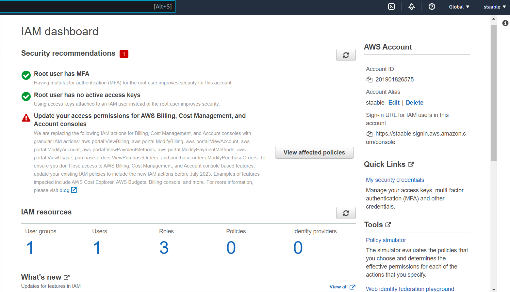
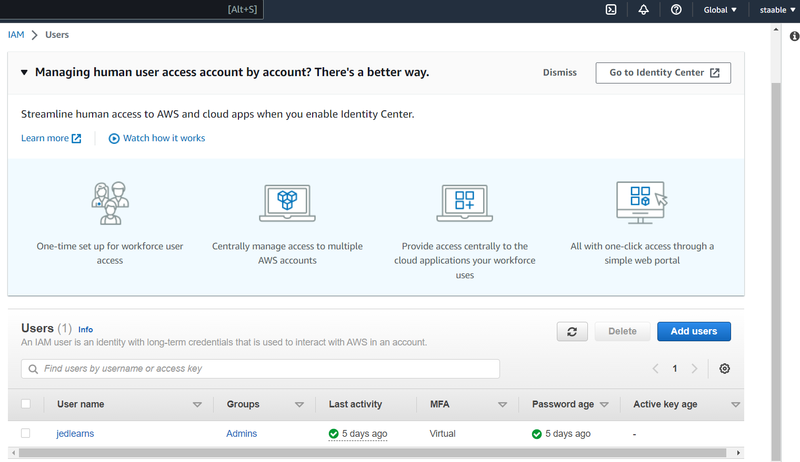
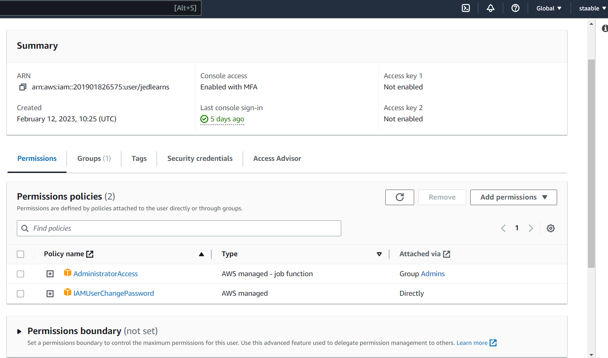
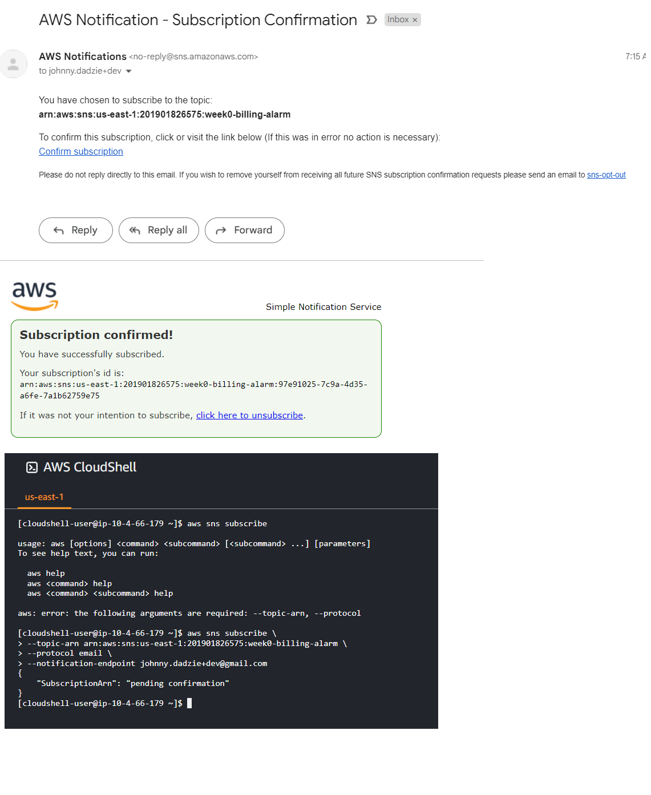
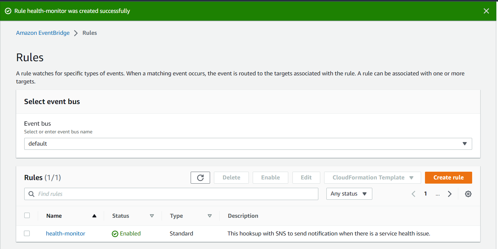
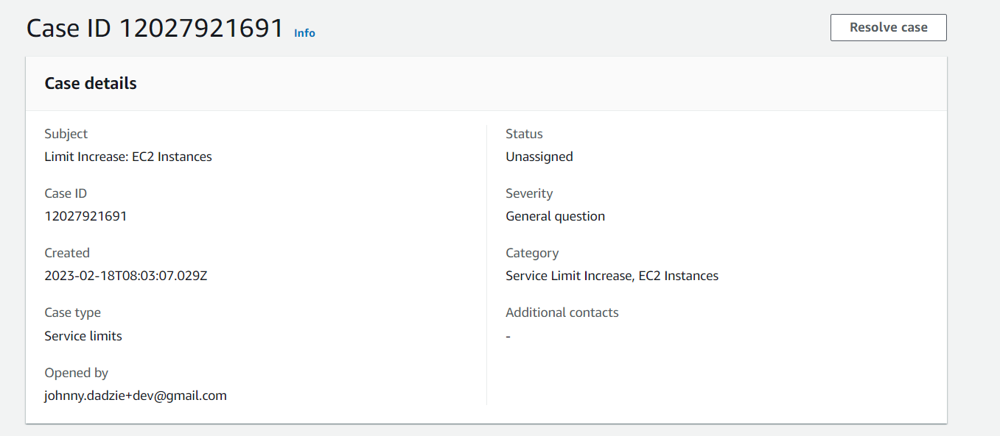

# Week 0 — Billing and Architecture
## Homework Hard Assignments
### Setting a Billing Alarm
This sections shows evidence of how I set up my billing alarm

### Setting a AWS Budget
This section shows evidence of the budget I set for my AWS spend

### Conceptual Architectural Diagram
This section shows logical architectural diagram inspired by Chris Williams and Andrew Brown.
[Link to logical architectural diagram](https://lucid.app/lucidchart/0e3bcaf8-44a0-4c9e-85dd-ce36f4c06341/edit?viewport_loc=-183%2C22%2C2560%2C1116%2C0_0&invitationId=inv_483a6ca7-bfda-46e4-9795-e1c0f6e251ad)

## Homework Stretch Assignments
### Destroy your root account credentials, Set MFA, IAM role
This sections provides details on root and IAM account with MFA as well as admin roles created.
.

This section also provides information on IAM user account created with MFA and ADMIN roles.

This section details the permissions associated with the group assigned to the IAM user.

### Using EventBridge hookup Health Dashboard with SNS
This sections show how I created the SNS topic and subscription using the cloudshell.

This section also shows the EventBridge Hookup Health Dashboard with SNS.

### Open a support ticket and request a service limit
This section shows evidence of how i created a support ticket to request for service limit increase

