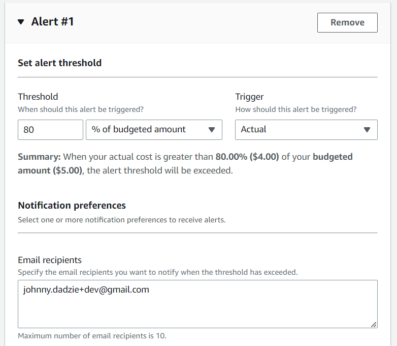
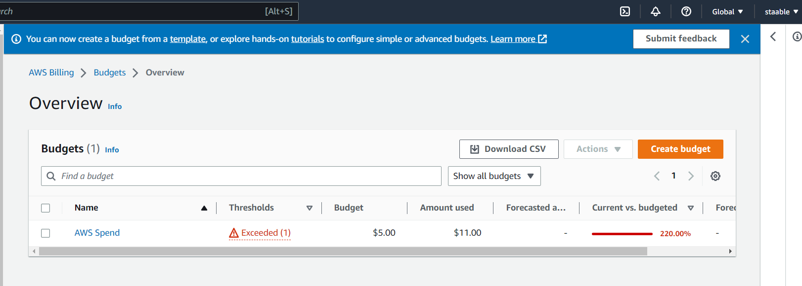
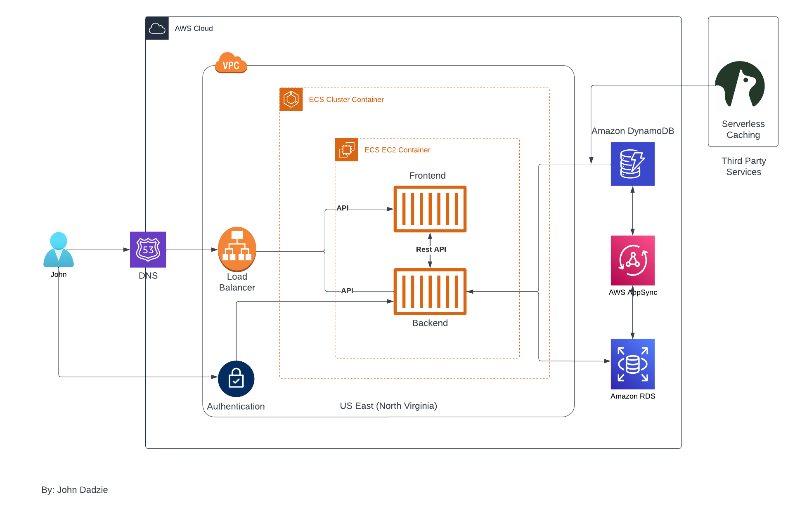

# Week 0 — Billing and Architecture
## Homework Hard Assignments
### Setting a Billing Alarm
This sections shows evidence of how I set up my billing alarm

### Setting a AWS Budget
This section shows evidence of the budget I set for my AWS spend

### Conceptual Architectural Diagram
This section shows logical architectural diagram inspired by Chris Williams and Andrew Brown
[Link to logical architectural diagram](https://lucid.app/lucidchart/0e3bcaf8-44a0-4c9e-85dd-ce36f4c06341/edit?viewport_loc=-183%2C22%2C2560%2C1116%2C0_0&invitationId=inv_483a6ca7-bfda-46e4-9795-e1c0f6e251ad)

## Homework Stretch Assignments
### Destroy your root account credentials, Set MFA, IAM role
